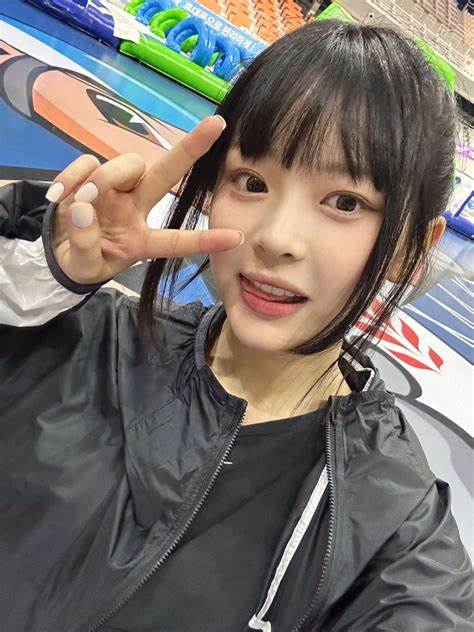

**[공지사항]** [지킬블로그 신규 업데이트 안내드립니다.](https://mmistakes.github.io/minimal-mistakes/docs/quick-start-guide/)
{: .notice--danger}

<div class="notice--success">
<h4>공지사항입니다.</h4>
<u1>
    <li>공지사항 순서1</li>
    <li>공지사항 순서1</li>
    <li>공지사항 순서1</li>
</u1>
</div>

[버튼입니다](https://google.com){: .btn .btn--danger}




# 오늘 처음 블로그를 만들었어요 

뉴진스 팜하니 사랑해!

**강해린도 사랑해!**


## 코딩 연습


```python

x = 15

if x > 9:
    print("Hello!")
else:
    print("Bye!")

print("End")

```

```python
x = 15

if x > 9:
    print("Hello!")
else:
    print("Bye!")

print("End")
```


## 이미지 목차

### 이미지 세부 목차1

이미지입니다.

### 이미지 세부 목차2

이미지입니다.

### 이미지 세부 목차3

이미지입니다.




# 제목2

안녕하세요?

